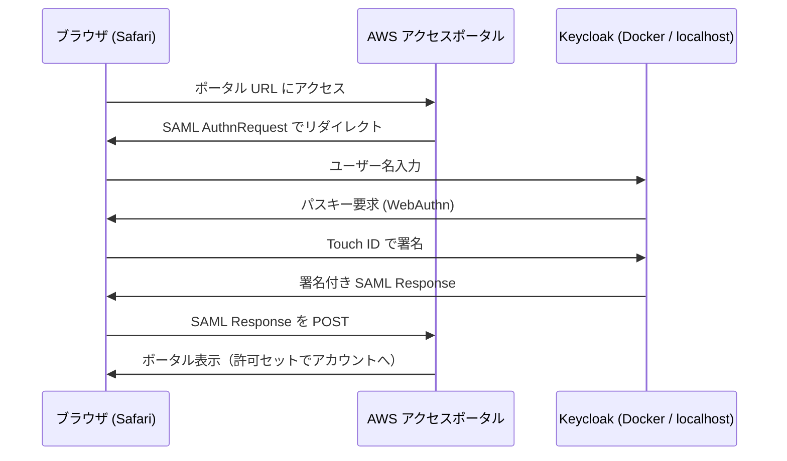

# aws-passkey-sso

Keycloak を外部 IdP として AWS IAM Identity Center と SAML 連携し、**パスワードなし・パスキー（Touch ID）だけで AWS アクセスポータルにサインインする**ための個人検証環境です。

## 構成



| 要素 | 内容 |
|---|---|
| IdP | Keycloak 26（`start-dev`、Docker で起動） |
| TLS | mkcert によるローカル CA 証明書 |
| ホスト名 | `idp.127.0.0.1.nip.io`（nip.io で 127.0.0.1 に解決） |
| SP | AWS IAM Identity Center（組織インスタンス、外部 IdP） |
| ユーザー同期 | 手動（SCIM は未使用） |
| 認証方式 | WebAuthn パスワードレス（iCloud キーチェーンのパスキー） |

Keycloak はインターネットに公開していません。SAML のやり取りはブラウザ経由で行われるため、AWS から Keycloak に直接到達できなくても連携できます。

## 前提

- macOS、Docker Desktop、Homebrew
- AWS Organizations を有効化した管理アカウント

## セットアップ

### 1. Keycloak を起動する

```bash
cp .env.example .env          # 管理者パスワードを書き換える
./scripts/gen-certs.sh        # certs/ に証明書を作成
docker compose up -d
```

1 分ほど待って `https://idp.127.0.0.1.nip.io` を Safari で開き、管理者でログインします。

### 2. Keycloak の設定

1. レルム `AWS` を作成
2. ユーザーを作成（ユーザー名・メール＝メールアドレス、名・姓を入力、Email verified をオン）
3. IAM Identity Center の SP メタデータを「Clients → Import client」で読み込む
4. 作成された SAML クライアントを以下のように設定
   - Name ID format: `email`、Force name ID format: オン
   - Sign documents / Sign assertions: オン
   - Keys タブ → Client signature required: **オフ**

### 3. IAM Identity Center の設定

1. アイデンティティソースを「外部 ID プロバイダー」に変更
2. IdP メタデータを取得してアップロード
```bash
   ./scripts/fetch-idp-metadata.sh
```
3. ユーザーを手動作成（**ユーザー名を Keycloak のユーザー名と完全一致**させる）
4. 許可セットを作成し、AWS アカウントにユーザーと許可セットを割り当て

### 4. パスキーでのサインイン

1. Authentication → Policies → Webauthn Passwordless Policy
   - User verification requirement: `required`
   - 発見可能な資格情報（Resident key / Require discoverable credential）: 必須
2. Authentication → Required actions で「Webauthn Register Passwordless」を有効化
3. ユーザーの Required user actions に同アクションを付与し、アカウントコンソール（`/realms/AWS/account`）にログインしてパスキーを登録
4. `browser` フローを複製して `passkey-browser` を作成し、forms を以下に変更
   - Username Form（Required）
   - WebAuthn Passwordless Authenticator（Required）
5. SAML クライアント → Advanced → Authentication flow overrides → Browser Flow に `passkey-browser` を設定

AWS アクセスポータルの URL を開き、ユーザー名 → Touch ID でポータルに入れれば完成です。

## ハマったところ

| 症状 | 原因 | 対処 |
|---|---|---|
| IdP メタデータのアップロードで `url validation failed` | IdP の URL が `http://localhost` | Keycloak を HTTPS 化 |
| HTTPS にしても同じエラー | `.test` など実在しない TLD は不可 | nip.io のような実在ドメイン名を使用 |
| ブラウザで `接続がリセットされました` | Chrome からのみ到達できなかった | Safari で動作確認 |
| Keycloak で `無効なリクエスト`（`saml_token_not_found`） | SAML エンドポイントを直接開いた・再読み込みした | 必ずポータル URL から開始 |
| AWS で `このコードは使用できません` | Identity Center 側に同名ユーザーがいない | ユーザー名を Keycloak と一致させて作成（作成後は変更不可） |
| `保存済みのパスキーはありません` | パスキー登録が完了していなかった | Required user action から登録し直し |
| `NoSuchFileException ... .pem` | 証明書が作られていなかった | `gen-certs.sh` を実行 |
| hosts の追記が効かない | 元ファイル末尾に改行がなく、コメント行に連結された | 改行を入れて追記し直し |

## 注意

- 学習用の構成です。`start-dev`（H2 データベース）のため本番利用には向きません。
- Keycloak が停止していると AWS にサインインできません。**ルートユーザーにパスキー MFA を設定し、Identity Center を経由しない経路を必ず残してください。**
- `certs/`、`.env`、SAML メタデータは `.gitignore` でリポジトリから除外しています。

## 今後やりたいこと

- Keycloak を EC2 / ECS へ移行し、PostgreSQL を使用
- SCIM によるユーザー自動同期
